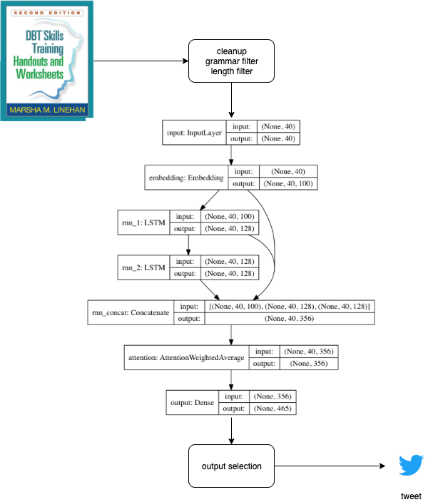

# dbtmindset-twitter



A bot that parses [Marsha Linehan's DBT Skills Training Handouts](https://projecticee.files.wordpress.com/2018/12/lin-c-dbt-handouts.pdf), and feeds it to a [RNN](https://en.wikipedia.org/wiki/Recurrent_neural_network) which generates tweets.

```bash
pip install -r requirements.txt

# extract sentences 
python extract.py

# clean white space
python clean.py

# train model weights
python train.py

# generate model output
python generate.py

```

### dependencies
* [NLTK](https://www.nltk.org/)
* [language-check](https://pypi.org/project/language-check/)
* [textgenrnn](https://github.com/minimaxir/textgenrnn)
* [tensorflow](https://www.tensorflow.org/)
